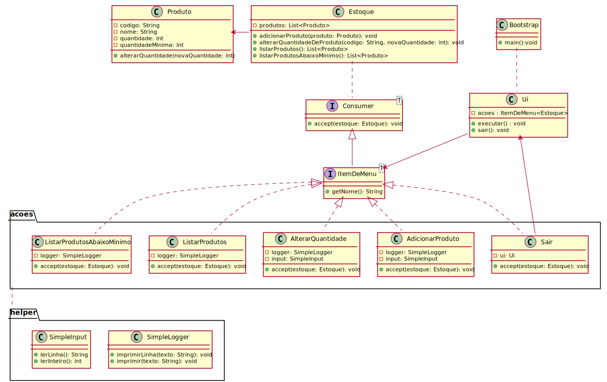

# Trabalho final - Controle de estoque

Observe o seguinte mapa:

O Sistema deve apresentar as seguintes opções: Inserir produto, adicionar quantidade de produtos no
estoque, retirar quantidade de produtos no estoque, listar todos os produtos, listar produtos que estão
abaixo do estoque e sair.
O produto deverá ter as seguintes informações: código, nome do produto, quantidade de produtos,
quantidade mínima (usada para controle).
O sistema deverá ter validações para códigos de produto, quantidades a serem adicionadas/removidas,
controlar o estoque mínimo, entre outras que podem aparecer no desenvolvimento do software.

## Arquitetura da solução

