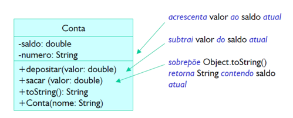

# Laboratório 1

Observe o seguinte diagrama

Escreva um programa para classe Conta, respeitando as convenções definidas em aula. Crie uma classe
ContaTeste manipule operações oferecidas pela API da classe. Simule diferentes situações, incluindo
depósitos, saques, consultas de saldo. Também simule situações em que não é possível fazer um saque (caso
de saldo = 0).