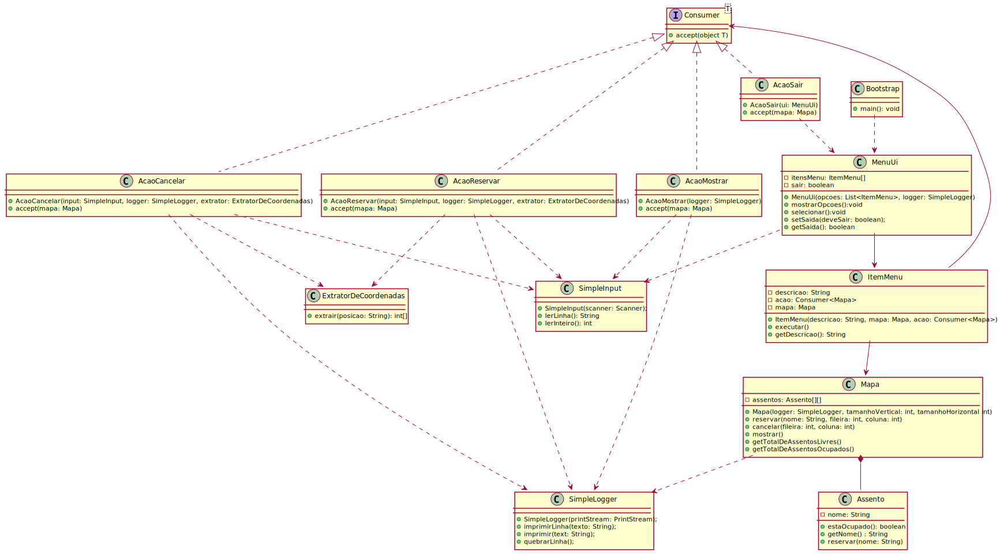

# Laboratório 2

Observe o seguinte mapa:

Acima, temos a localização de assentos em um cinema. A posição é dada pela letra (linha) e pelo número
(coluna). Por exemplo, no diagrama está sinalizado em azul o lugar C4.

Escreva uma aplicação que apresente um menu de opções, permitindo fazer uma reserva, cancelar uma
reserva, mostrar quais assentos estão livres/ocupados (mapa) e mostrar o total de lugares livres/ocupados.
Usem sua criatividade para construir o software.

Procure separar as classes com base nas suas funcionalidades, inclusive nos pacotes que acharem
adequados.

Sugestão de classes: Menu, Opcoes (reservar, cancelar, mostrar mapa e quantidades), Mapa e Assento.
Dica: Para entrada de dados, sugiro usar a Classe Scanner, da API do Java

## Arquitetura da solução

